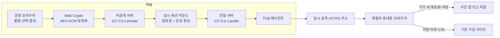

# UMC 동아리 박람회 네컷 체험 서비스 설계

- 작성일: 2026-08-10
- 상태: 사용자 승인 완료
- 목적: 맥북 카메라를 이용한 팀 네컷 체험을 제공하고, 사진을 안전하게 전달한 뒤 기존 동아리 가입 사이트로 연결한다.

## 1. 목표와 성공 기준

이 서비스는 1~4인 팀이 맥북 한 대에서 여섯 장을 촬영하고, 네 장과 프레임을 선택해 완성 사진을 만드는 현장 체험이다. 완성 사진은 각 팀원의 휴대폰으로 전달하며, 사진 저장 후 기존 IT 개발 동아리 가입 사이트로 연결한다.

운영 가정은 시간당 10팀 이하이고, 한 팀의 촬영 시작부터 QR 표시까지 4분 이내이다.

초기 성공 기준은 다음과 같다.

- 체험 완료율 90% 이상
- QR 페이지에서 암호문 다운로드·복호화·미리보기까지의 성공률 95% 이상
- 체험 완료 팀 대비 가입 사이트 방문율 30% 이상
- QR 페이지 첫 표시 5초 이내
- 앱 수준에서 맥북 디스크에 평문 사진을 저장하지 않음
- QR 발급 10분 뒤 접근을 즉시 차단하고, 만료 파일은 다음 5분 주기 정리에서 물리적으로 삭제

## 2. 범위

### 포함

- 맥북 내장 카메라를 이용한 촬영
- 컷마다 5초 카운트다운을 적용한 여섯 장 연속 촬영
- 여섯 장 중 네 장을 선택하고 순서를 정하는 UX
- 디자이너가 제공한 프레임 선택 및 최종 이미지 합성
- 브라우저 내 최종 이미지 암호화
- 맥북 로컬 서버에 암호문을 10분간 임시 보관
- 임시 공개 HTTPS 주소를 통한 휴대폰 전달
- 팀원 여러 명의 동일 QR 동시 사용
- 사진 저장 후 기존 가입 사이트 링크 노출
- 모든 운영 화면의 우측 상단 긴급 초기화 버튼
- 개인정보를 수집하지 않는 운영 집계

### 제외

- 시각 디자인, 브랜드 그래픽, 프레임 아트 제작
- 사진 인쇄
- 외부 클라우드 객체 저장소
- 사용자 계정, 전화번호, 이메일 또는 지원서 수집
- 기존 가입 사이트 수정
- 자동 SNS 게시 또는 연락처 기반 공유
- 전용 모바일 앱
- 고정 도메인 구매 및 설정

## 3. 핵심 결정

| 항목 | 결정 |
|---|---|
| 촬영 단위 | 1~4인 팀 |
| 촬영 횟수 | 컷마다 5초 카운트다운, 총 6장 |
| 결과 선택 | 선택 순서대로 1~4번을 부여해 정확히 4장 선택 |
| 프레임 | 사진 선택 후 프레임 선택 및 미리보기 |
| 사진 보관 | 맥북 로컬 서버에 암호문만 보관 |
| 암호화 | 촬영 브라우저에서 세션별 AES-GCM 키로 암호화 |
| 공개 연결 | 별도 도메인 없는 임시 HTTPS 터널 |
| 만료 | QR 생성 시점부터 10분 |
| 가입 전환 | 사진 저장 이후 기존 사이트로 이동 |
| 초기화 | 모든 화면 우측 상단에 `처음으로` 버튼 고정 |

## 4. 시스템 구조

하나의 TypeScript 애플리케이션이 맥북에서 실행되며 비공개 운영 포트와 공개 전달 포트를 별도로 연다. 두 포트는 같은 세션 저장소를 사용하지만 공개 전달 포트는 카메라, 촬영 상태, 관리 기능에 접근할 수 없다.



### 4.1 운영 브라우저

- 카메라 권한과 스트림을 관리한다.
- 여섯 장의 원본을 브라우저 메모리에만 유지한다.
- 네 장 선택 순서와 프레임 선택 상태를 관리한다.
- 최종 이미지를 브라우저 캔버스에서 합성한다.
- 세션별 256비트 무작위 키와 96비트 nonce를 생성하고 AES-GCM으로 암호화한다.
- 암호문을 비공개 서버로 전송하고 세션 ID를 받는다.
- 공개 주소, 세션 ID, 복호화 키를 조합해 QR을 생성한다.
- 최근 발급 세션의 키는 재발급을 위해 만료 시점까지만 브라우저 메모리에 유지하며 서버나 디스크에는 기록하지 않는다.

### 4.2 비공개 서버

- 루프백 주소에만 바인딩하고 터널에 연결하지 않는다.
- 운영 UI와 암호문 생성 API를 제공한다.
- 세션 ID를 암호학적으로 안전한 무작위 값으로 생성한다.
- 암호문을 먼저 `pending` 세션으로 저장하고, 운영 브라우저의 활성화 요청을 받은 시점에 10분 만료 시각을 확정한다.
- 활성화되지 않은 `pending` 세션은 생성 2분 뒤 자동 삭제한다.
- 암호문과 최소 메타데이터를 임시 저장소에 기록한다.
- 카메라, 촬영, 프레임 합성 로직을 직접 수행하지 않는다.

비공개 API 표면은 다음으로 제한한다.

- `GET /api/status`: 카메라를 제외한 로컬 서버, 터널, 정리 작업 상태
- `POST /api/sessions`: 암호문을 `pending` 상태로 생성
- `POST /api/sessions/:id/activate`: 세션을 활성화하고 10분 만료 시각 확정
- `DELETE /api/sessions/:id`: QR을 발급하지 않은 현재 세션 폐기

### 4.3 공개 전달 서버

- 별도의 루프백 포트에서 실행하고 이 포트만 터널에 연결한다.
- 다운로드 페이지, 암호문 조회, 상태 확인, 허용된 집계 이벤트만 제공한다.
- 세션 목록, 원본 파일, 삭제, 촬영 또는 관리 API를 제공하지 않는다.
- 모든 응답에 `Cache-Control: no-store`를 적용한다.
- 만료 시각 이후에는 파일이 삭제 대기 중이어도 `410 Gone`으로 응답한다.

공개 API 표면은 다음으로 제한한다.

- `GET /health`: 터널 외부 상태 확인
- `GET /d/:id`: 다운로드 애플리케이션 제공
- `GET /f/:id`: 활성 세션의 암호문 제공
- `POST /events`: `decrypt_success`, `save_intent`, `join_click` 중 하나의 누적 카운터 증가

그 밖의 경로와 메서드는 `404 Not Found` 또는 `405 Method Not Allowed`로 거부한다.

### 4.4 임시 HTTPS 터널

초기 구현은 `cloudflared` Quick Tunnel을 기본 어댑터로 사용한다. 이 방식은 도메인 없이 무작위 `trycloudflare.com` 주소를 발급하고 localhost 요청을 공개 인터넷으로 전달한다. 앱 실행기는 터널 프로세스의 출력을 읽어 공개 주소를 획득하고, 외부 상태 확인이 성공한 후에만 촬영 시작을 허용한다.

Cloudflare 공식 문서는 Quick Tunnel을 개발·테스트 용도로 규정하며 SLA를 보장하지 않는다. 따라서 행사 전 실제 네트워크 리허설을 하고, 터널 중단 시 재시작과 QR 재발급을 지원한다. 행사 수준의 가용성이 더 중요해지면 기존 동아리 도메인에 등록형 터널을 붙이는 것을 후속 개선으로 둔다.

## 5. 세션 데이터와 수명주기

서버가 보관하는 세션 데이터는 다음 다섯 항목뿐이다.

```text
sessionId: 128비트 무작위 식별자의 base64url 표현
createdAt: pending 세션 정리를 위한 생성 시각
expiresAt: pending 상태에서는 null, 활성화 시각 + 10분
encryptedFile: 버전 헤더, 96비트 nonce, AES-GCM 암호문과 인증 태그
status: pending | active | expired
```

복호화 키는 QR URL의 fragment에 넣는다.

```text
https://<temporary-host>/d/<session-id>#key=<base64url-key>
```

URL fragment는 HTTP 요청에 포함되지 않으므로 전달 서버와 터널 로그에 키가 전달되지 않는다. 휴대폰 다운로드 페이지가 fragment에서 키를 읽고 암호문을 받아 기기 안에서 복호화한다.

수명주기는 다음과 같다.

1. 최종 프레임이 확정되면 운영 브라우저가 사진을 합성하고 암호화한다.
2. 비공개 서버가 암호문을 `pending` 상태로 저장하고 세션 ID를 반환한다. `pending` 세션은 공개 서버에서 조회할 수 없다.
3. 운영 브라우저가 현재 공개 주소와 세션 ID로 QR 데이터를 준비한다.
4. 운영 브라우저가 비공개 활성화 API를 호출하면 서버가 `expiresAt = 현재 시각 + 10분`으로 기록하고 세션을 `active`로 바꾼다.
5. 활성화 응답을 받은 운영 브라우저가 QR을 표시한다. 활성화 요청에 실패하면 QR을 표시하지 않는다.
6. QR 표시 후 여섯 원본과 최종 평문 이미지의 참조를 해제하고 임시 object URL을 폐기한다.
7. 만료 시각부터 공개 서버는 접근을 거부한다.
8. 30초 주기의 정리 작업이 만료 암호문과 메타데이터 및 2분 이상 된 `pending` 세션을 삭제한다.
9. 앱 시작 시 만료 파일을 우선 삭제하고, 운영 종료 명령은 남은 모든 세션을 삭제한다.

JavaScript와 운영체제의 메모리 관리 특성상 참조 해제가 물리 메모리의 즉시 덮어쓰기를 보장하지는 않는다. 이 설계가 보장하는 범위는 앱이 평문을 파일, 데이터베이스, 브라우저 저장소 또는 서버 로그에 영속화하지 않는 것이다.

## 6. 사용자 경험

### 6.1 시작과 동의

- 부스는 1~4인 팀을 받는다.
- 시작 화면은 촬영 동의와 `QR은 발급 후 10분 동안 이용할 수 있으며, 만료 후 암호화된 사진은 자동 삭제됩니다` 안내를 제공한다.
- 대표자가 팀원 모두의 촬영 동의를 확인한다.
- 이름, 전화번호, 이메일 또는 계정을 요구하지 않는다.

### 6.2 여섯 장 촬영

- 각 컷 전에 동일한 5초 카운트다운을 표시한다.
- 현재 진행 상태를 `3 / 6` 형태로 명확하게 보여준다.
- 여섯 개의 포즈 안내는 설정 파일로 주입하며 디자이너가 제공한 문구나 이미지를 사용할 수 있다.
- 한 컷의 카메라 캡처가 실패하면 해당 컷만 5초 카운트다운부터 다시 진행한다.
- 촬영 중 개별 삭제나 순서 변경은 허용하지 않는다.

### 6.3 네 장 선택

- 촬영이 끝나면 여섯 장을 같은 크기의 그리드로 보여준다.
- 사진을 누른 순서대로 `1`, `2`, `3`, `4` 배지를 표시한다.
- 선택을 해제하면 뒤 번호를 자동으로 당긴다.
- 정확히 네 장을 선택해야 다음 단계 버튼이 활성화된다.
- `선택 초기화`는 사진을 삭제하지 않고 네 장의 선택 상태만 비운다.

### 6.4 프레임 선택

- 선택한 네 장을 유지한 채 프레임 후보를 보여준다.
- 프레임을 바꾸면 최종 사진 미리보기가 즉시 갱신된다.
- 프레임 확정 전에는 암호화 파일이나 서버 세션을 만들지 않는다.

### 6.5 QR과 사진 저장

- 암호화, 로컬 저장, 공개 URL 상태 확인이 모두 성공한 뒤 QR을 표시한다.
- QR 화면은 `팀원 모두 각자 스캔할 수 있습니다`와 남은 시간을 표시한다.
- 한 세션의 암호문은 만료 전까지 여러 휴대폰에서 내려받을 수 있다.
- 휴대폰은 암호문을 복호화한 뒤 사진 미리보기와 저장 동작을 제공한다.
- 파일 공유 API를 지원하는 브라우저에서는 시스템 공유 시트를 우선 사용하고, 지원하지 않으면 다운로드 링크와 운영체제별 저장 안내를 제공한다.
- 저장 동작 뒤 `지원 페이지 보기` 버튼을 노출한다. 사진 다운로드를 가입으로 막지 않는다.
- 가입 주소는 실행 설정 `JOIN_SITE_URL`로 제공하며 유효한 HTTPS 주소가 없으면 앱 사전 점검이 실패한다. 이 주소에는 행사 유입을 구분할 UTM 값을 포함한다.

## 7. 긴급 초기화

모든 운영 화면의 우측 상단 같은 위치에 `처음으로` 버튼을 표시한다.

버튼을 누르면 다음 내용만 있는 확인 모달을 연다.

- 문구: `처음 화면으로 돌아갈까요?`
- 버튼: `취소`, `확인`

`확인`의 내부 동작은 다음과 같다.

1. 진행 중인 카운트다운, 촬영, 합성, 암호화, 업로드를 취소한다.
2. 현재 팀의 원본, 선택 상태, 프레임 상태, 평문 합성본과 아직 QR을 발급하지 않은 암호문을 폐기한다.
3. 세션 generation token을 증가시켜 늦게 끝난 비동기 작업의 결과를 무시한다.
4. 카메라, 터널, 만료 정리 작업을 다시 점검한다.
5. 초기 화면으로 돌아간다.

이미 QR을 발급한 이전 팀의 암호문은 초기화 대상이 아니며 각자의 만료 시각까지 다운로드할 수 있다.

## 8. 디자이너 전달 계약

시각 디자인은 별도 담당자가 진행한다. 구현은 다음 입력 형식을 제공해 디자인과 로직을 분리한다.

각 프레임 팩은 다음 정보를 가진다.

- 고유 ID와 화면 표시 이름
- 프레임 썸네일
- 최종 캔버스 너비와 높이
- 정확히 네 개의 사진 슬롯 좌표, 크기, 회전, 맞춤 방식
- 사진 위에 합성할 투명 PNG 또는 SVG 오버레이
- JPEG 내보내기 품질. 기본값은 0.92이며 설정으로 변경할 수 있다.

앱 시작 시 프레임 팩을 검증한다. 프레임이 하나도 없거나 슬롯이 네 개가 아니거나 자산을 읽을 수 없으면 촬영 시작을 차단한다.

디자이너는 시작, 동의, 카운트다운, 결과 선택, 프레임 선택, QR, 만료, 오류, 초기화 모달의 시안을 제공한다. 구현은 상태 전이와 필수 문구를 유지하되 색상, 타이포그래피, 간격, 애니메이션을 시안에 맞춘다.

## 9. 오류 처리와 운영

### 9.1 사전 점검

다음 항목이 모두 정상이 아니면 `체험 시작`을 비활성화한다.

- 카메라 권한과 영상 스트림
- 비공개 서버
- 공개 전달 서버
- 임시 HTTPS 터널과 외부 상태 확인
- 만료 정리 작업의 최근 성공 시각
- 유효한 가입 사이트 주소
- 유효한 프레임 팩

### 9.2 촬영과 전달 오류

- 단일 캡처 실패: 해당 컷만 재촬영한다.
- 암호화 또는 로컬 저장 실패: 최종 평문을 메모리에 유지한 채 1초와 2초 간격으로 자동 재시도해 총 세 번 시도한다. 모두 실패하면 `다시 시도`와 `처음으로`만 제공하고 QR을 표시하지 않는다.
- 브라우저 새로고침 또는 종료: 가능한 경우 현재 미발급 세션 삭제를 요청하고 초기 화면으로 복구한다. 종료로 요청을 보내지 못한 `pending` 세션은 생성 2분 뒤 정리 작업이 삭제한다.
- QR 발급 전 터널 장애: 신규 QR을 만들지 않고 터널 재연결을 시도한다.
- QR 발급 후 터널 주소 변경: 운영 브라우저 메모리에 남은 키와 같은 세션 ID로 새 QR을 발급한다.
- 만료된 링크: 사진 대신 삭제 완료 화면을 제공하며 평문 전달로 우회하지 않는다.
- 지원하지 않는 모바일 브라우저: 지원 브라우저 안내를 표시하며 암호화를 제거한 대체 링크를 제공하지 않는다.

### 9.3 운영자 상태

운영 화면은 사진 썸네일 없이 다음 정보만 표시한다.

- 카메라 상태
- 터널 상태와 외부 응답 시간
- 만료 정리 작업의 최근 성공 시각
- 현재 활성 암호문 수
- 남은 임시 저장 공간

### 9.4 행사 시작과 종료

시작 전에는 맥북 전원 연결, 자동 잠자기 해제, 방해금지 모드, 카메라 구도, 프레임 자산, 개인 Wi-Fi, 실제 휴대폰 데이터망 다운로드를 확인한다.

종료 시 신규 촬영을 먼저 막는다. 마지막 QR의 10분을 보장한 뒤 `운영 종료 및 전체 삭제`를 실행하고 임시 저장소가 비었는지 확인한 다음 터널과 서버를 종료한다.

## 10. 개인정보와 보안

### 수집하지 않는 정보

- 이름, 전화번호, 이메일, 계정
- 촬영 인원 또는 선택한 사진의 의미 정보
- 복호화 키
- 앱 로그의 IP 주소와 전체 세션 URL
- 사진과 연결되는 분석 식별자

### 통제

- 세션 ID는 추측하기 어렵게 생성한다.
- 복호화 키는 URL fragment와 양쪽 브라우저 메모리에만 존재한다.
- 서버 로그는 세션 ID를 마스킹하고 전달 프록시 헤더의 IP 값을 기록하지 않는다.
- 공개 서버에는 세션 목록, 업로드, 삭제 또는 관리 기능이 없다.
- HTML과 파일 응답은 캐시를 금지하고 referrer 전송을 차단한다.
- 제3자 분석 스크립트, 광고 스크립트, 원격 오류 수집 SDK를 넣지 않는다.

### 보호 범위의 한계

- QR을 10분 안에 제3자에게 공유하면 그 사람도 사진을 열 수 있다.
- 터널 사업자는 접속 시각과 IP 같은 통신 메타데이터를 처리할 수 있다.
- 맥북이나 휴대폰 자체가 침해되면 브라우저에 보이는 평문을 보호할 수 없다.
- 휴대폰에 저장된 뒤의 복사와 공유는 서비스가 통제하지 않는다.

## 11. 부스 유입과 가입 전환

- 전면 메시지는 `친구와 무료 네컷 촬영 · 휴대폰으로 바로 저장`을 중심으로 한다.
- 보조 문구로 `앱 설치 없음 · QR은 10분 후 만료`를 표시한다.
- 1~4인 팀 참여를 안내해 한 명이 친구를 데려오게 한다.
- 실제 참여자의 사진을 외부 모니터에 노출하지 않고 예시 포즈와 진행 방법만 보여준다.
- 여섯 컷에 개발 테마 포즈 안내를 넣어 대기 중에도 체험 내용을 이해하게 한다.
- QR은 팀원 모두가 스캔할 수 있게 해 가입 CTA가 각자의 휴대폰에 나타나게 한다.
- 결과 사진에는 디자이너가 동아리 식별 요소를 포함해 자발적 공유가 홍보로 이어지게 한다.
- 추첨, 경품 응모, 연락처 수집은 초기 버전에서 제외한다.

## 12. 측정

사진이나 개인 식별자와 연결하지 않는 누적 카운터만 사용한다.

- 체험 시작 수
- 사진 완성 및 QR 발급 수
- QR 페이지 요청 수
- 암호문 다운로드 성공 수
- 저장 동작 이벤트 수
- 가입 CTA 클릭 수

공개 집계 이벤트는 허용된 이벤트 이름과 숫자 증가만 받는다. 세션 ID나 브라우저 식별자는 본문에 포함하지 않으며 서버는 전달된 IP 헤더를 읽거나 기록하지 않는다. 전역 초당 10건을 넘는 집계 요청은 버려 행사 지표의 무제한 증가를 막는다. 이 카운터는 개인정보 없는 현장 추세 확인용이며 정산 수준의 정확성을 보장하지 않는다. 가입 사이트 방문은 `JOIN_SITE_URL`에 포함된 UTM으로 별도 집계한다.

## 13. 검증 계획

### 기능

- 5초 카운트다운이 여섯 번 실행되는지 확인한다.
- 한 컷 실패 시 그 컷만 다시 촬영되는지 확인한다.
- 네 장 미만에서는 다음 단계가 비활성화되는지 확인한다.
- 선택 해제 시 순서 배지가 올바르게 당겨지는지 확인한다.
- 선택 순서와 최종 프레임 슬롯 순서가 일치하는지 확인한다.
- 프레임 변경이 미리보기에 즉시 반영되는지 확인한다.
- 여러 휴대폰이 같은 QR로 사진을 내려받을 수 있는지 확인한다.
- 저장 후 가입 링크가 올바른 UTM 주소를 여는지 확인한다.

### 초기화

- 시작, 촬영, 선택, 프레임, QR 화면에서 버튼이 항상 보이는지 확인한다.
- 모달에 지정된 문구와 두 버튼만 표시되는지 확인한다.
- 확인 후 3초 이내 초기 상태로 돌아오는지 확인한다.
- 초기화 시 현재 미발급 세션이 제거되는지 확인한다.
- 초기화 후 늦게 끝난 비동기 결과가 화면에 나타나지 않는지 확인한다.
- 이미 발급된 이전 팀 QR은 유지되는지 확인한다.

### 개인정보와 만료

- 올바른 키로만 암호문이 복호화되는지 확인한다.
- 잘못된 키와 변조된 암호문이 인증 오류로 실패하는지 확인한다.
- 맥북 임시 디렉터리와 앱 로그에 평문 사진이나 키가 없는지 검사한다.
- 만료 시각부터 요청이 `410 Gone`인지 확인한다.
- 만료 파일이 30초 이내 삭제되는지 확인한다.
- 서버 재시작 시 만료 파일이 정리되는지 확인한다.

### 기기와 네트워크

- 행사에 사용할 맥북과 브라우저에서 카메라 권한, 해상도, 장시간 스트림을 확인한다.
- 최신 iPhone Safari와 Android Chrome에서 QR, 복호화, 미리보기, 저장을 확인한다.
- 개인 Wi-Fi와 휴대폰 셀룰러망 사이의 실제 다운로드를 확인한다.
- 터널 단절, 재시작, 임시 주소 변경 후 QR 재발급을 확인한다.
- 느린 네트워크에서 중복 요청과 재시도가 세션을 손상시키지 않는지 확인한다.

### 현장 리허설

- 실제 조명과 배경에서 10팀을 연속으로 시뮬레이션한다.
- 총 60회 촬영 동안 카메라 멈춤, 메모리 증가, 이전 팀 사진 노출이 없는지 확인한다.
- 각 팀의 촬영 시작부터 QR 표시까지 4분 이내인지 측정한다.
- 운영 종료 후 임시 저장소가 비어 있는지 확인한다.

## 14. 위험과 완화

| 위험 | 영향 | 완화 |
|---|---|---|
| Quick Tunnel은 SLA가 없음 | QR 다운로드 중단 | 사전 셀룰러 리허설, 상태 점검, 자동 재시작, QR 재발급 |
| 맥북 잠자기 또는 전원 문제 | 전체 서비스 중단 | 전원 연결, 자동 잠자기 해제, 운영 체크리스트 |
| 개인 Wi-Fi 불안정 | 업로드·다운로드 지연 | 시작 전 외부 상태 점검, 촬영 시작 잠금, 재시도 |
| QR 노출 또는 공유 | 10분 동안 제3자 접근 | 짧은 만료, 세션별 키, QR 화면의 현장 관리 |
| 모바일 저장 UX 차이 | 사진 저장 실패 | Web Share 우선, 다운로드 대체, iOS·Android 실기기 시험 |
| 운영자가 초기화를 잘못 누름 | 현재 촬영 손실 | 2단계 확인 모달, 발급 완료 세션과 현재 세션 분리 |

## 15. 구현 전제

- 언어는 TypeScript를 사용한다.
- 운영 UI와 휴대폰 UI는 브라우저 애플리케이션으로 구현한다.
- 서버 런타임은 맥북의 로컬 Node.js 프로세스다.
- 데이터베이스는 사용하지 않고 전용 임시 디렉터리와 최소 메타데이터 파일을 사용한다.
- 공개 URL, 가입 사이트 URL, 프레임 팩, 포즈 안내는 런타임 설정으로 주입한다.
- 구현 계획은 이 문서의 모듈 경계와 인수 조건을 기준으로 별도 작성한다.

## 16. 참고 자료

- [Cloudflare Quick Tunnels 공식 문서](https://developers.cloudflare.com/cloudflare-one/networks/connectors/cloudflare-tunnel/do-more-with-tunnels/trycloudflare/)
- [Cloudflare Tunnel 공식 개요](https://developers.cloudflare.com/cloudflare-one/networks/connectors/cloudflare-tunnel/)
